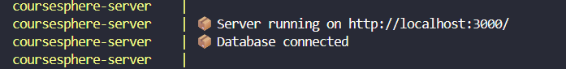

# 🚀 CourseSphere — Gestão de Cursos Online

Bem-vindo ao **CourseSphere**, uma plataforma full-stack para gestão colaborativa de cursos e aulas.

O projeto foi desenvolvido com foco em:

- Arquitetura Full Stack moderna
- APIs RESTful com Ruby on Rails
- Frontend performático com React 19
- Containerização com Docker
- Integração entre múltiplos serviços
- Boas práticas de organização e escalabilidade

---

## ✅ Ambiente Dockerizado

O ambiente foi configurado para garantir:

- Inicialização automática do servidor Rails
- Conexão com PostgreSQL via Docker Compose
- Execução automática de migrações
- Sincronização entre frontend e backend

---

# 🔗 Links de Deploy

| Serviço | URL |
| :--- | :--- |
| **Frontend (Vercel)** | [CourseSphere Frontend](https://coursesphere-fullstack-vfyy.vercel.app?utm_source=chatgpt.com) |
| **Backend (Render)** | [CourseSphere API](https://coursesphere-api-biaq.onrender.com?utm_source=chatgpt.com) |

---

# 🛠️ Stack Tecnológica


## Frontend (Client)

### ⚛️ Core

| Tecnologia | Função |
| :--- | :--- |
| **React 19** | Biblioteca principal da interface |
| **TypeScript** | Tipagem estática |
| **Vite** | Build tool e dev server |

---

### 📦 Estado & Dados

| Tecnologia | Função |
| :--- | :--- |
| **TanStack Query (v5)** | Cache e sincronização de dados |
| **Axios** | Cliente HTTP |

---

### 🎨 UI & Styling

| Tecnologia | Função |
| :--- | :--- |
| **Tailwind CSS v4** | Estilização utilitária |
| **Shadcn UI** | Biblioteca de componentes |
| **Lucide React** | Ícones vetoriais |
| **Sonner** | Sistema de Toasts |

---

### 🧾 Formulários

| Tecnologia | Função |
| :--- | :--- |
| **React Hook Form** | Gerenciamento de formulários |
| **Zod** | Validação de schemas |

---

### 🧭 Roteamento

| Tecnologia | Função |
| :--- | :--- |
| **React Router DOM v7** | Navegação SPA |

---

### 🧪 Testes

| Tecnologia | Função |
| :--- | :--- |
| **Vitest** | Testes unitários |
| **Testing Library** | Testes focados no usuário |

---

# Backend (Server)


## 🏗️ Estrutura

| Tecnologia | Função |
| :--- | :--- |
| **Ruby on Rails 7 (API Mode)** | Backend RESTful |
| **PostgreSQL** | Banco de dados relacional |

---

## 🔐 Autenticação

| Tecnologia | Função |
| :--- | :--- |
| **BCrypt** | Hash seguro de senhas |
| **JWT** | Autenticação baseada em tokens |

---

## 🔄 Serialização

| Tecnologia | Função |
| :--- | :--- |
| **Representers** | Estruturação das respostas JSON |

---

# 🐳 Infraestrutura

| Tecnologia | Função |
| :--- | :--- |
| **Docker** | Containerização do ambiente |
| **Docker Compose** | Orquestração dos serviços |

---

# 📏 Qualidade de Código

| Tecnologia | Função |
| :--- | :--- |
| **ESLint** | Padronização TypeScript/React |
| **RuboCop** | Padronização Ruby/Rails |

---

# Como Rodar Localmente


## 1️⃣ Configuração de Variáveis (`.env`)

Antes de iniciar o projeto, configure os arquivos de ambiente baseando-se nos exemplos fornecidos.

### Backend (`/server`)

Copie:

```bash
.env.example -> .env
```

Ajuste as credenciais do banco de dados conforme necessário.

---

### Frontend (`/client`)

Copie:

```bash
.env.example -> .env
```

Garanta que:

```env
VITE_API_URL=http://localhost:3000/api/v1
```

---

# 🐳 2️⃣ Rodando o Backend (Docker)

O backend gerencia automaticamente:

- Servidor Rails
- Banco PostgreSQL
- Migrações
- Sincronização do ambiente

---

## Navegue até o diretório do servidor

```bash
cd server
```

---

## Suba os containers

```bash
docker-compose up --build
```

### Certifique-se de identificar o seguinte item no log para confirmar que os serviços estão rodando:



O Docker irá:

- instalar as Gems
- configurar o banco
- executar migrações
- iniciar o servidor Rails automaticamente

---

## Rodar Migrações Manualmente (Caso necessário)

Em um novo terminal:

```bash
cd server
docker-compose exec server bundle exec rails db:migrate
```

---

# 💻 3️⃣ Rodando o Frontend

O frontend irá consumir a API executada via Docker.

---

## Navegue até o diretório do cliente

```bash
cd client
```

---

## Instale as dependências

```bash
pnpm install
```

---

## Inicie o ambiente de desenvolvimento

```bash
pnpm run dev
```

A aplicação estará disponível em:

```txt
http://localhost:5173
```

---

# 🔐 Usuário de Teste

Você pode:

- criar uma conta manualmente
- ou utilizar as credenciais pré-configuradas

| Campo | Valor |
| :--- | :--- |
| **E-mail** | `arthur@teste.com` |
| **Senha** | `password123` |

---

# 📂 Estrutura do Projeto

```txt
.
├── client/              # Frontend React (PNPM + Vite)
├── server/              # Backend Rails (Dockerized)
│   ├── Dockerfile
│   ├── docker-compose.yml
│   └── entrypoint.sh
├── assets/              # Assets de documentação
└── README.md
```

---

## 📌 Observações

O `entrypoint.sh` é responsável por:

- limpeza de arquivos PID
- sincronização do banco
- execução de migrações
- inicialização do servidor Rails

---