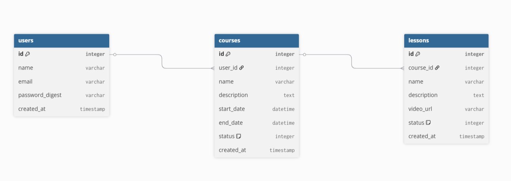

# CourseSphere — Lógica de Negócio

Documentação da arquitetura de dados, regras de visibilidade e fluxo de serialização da API.

---

## 1. Esquema Relacional

O sistema é estruturado em três entidades principais:

- Usuários (`Users`)
- Cursos (`Courses`)
- Aulas (`Lessons`)



---

## 2. Serialização com Representers

A API utiliza o padrão **Representer** para controlar os dados retornados ao frontend.

Fluxo da informação:

```text
Database → Model → Representer → Controller → JSON API
```

### Objetivos

- Evitar exposição de dados sensíveis
- Padronizar respostas JSON
- Centralizar regras de serialização

Exemplo:

- `password_digest` nunca é retornado pela API

---

## 3. Regras de Negócio

### Status de Publicação

`Courses` e `Lessons` utilizam controle de publicação via `status`.

| Status | Valor |
|---|---|
| Draft | `0` |
| Published | `1` |

---

### Visibilidade

#### Público

Usuários não autenticados podem:

- Listar cursos publicados
- Visualizar cursos publicados
- Visualizar aulas publicadas

#### Proprietário

O autor pode:

- Criar, editar e excluir cursos
- Criar, editar e excluir aulas
- Visualizar conteúdos em draft

---

### Autenticação

A criação e gerenciamento de recursos exige autenticação.

Relacionamentos principais:

- `courses.user_id`
- `lessons.course_id`

---

## 4. Endpoints

A documentação dos endpoints está separada por domínio:

- [Usuários](USERS_CRUD.md)
- [Cursos](COURSES_CRUD.md)
- [Aulas](LESSONS_CRUD.md)

---